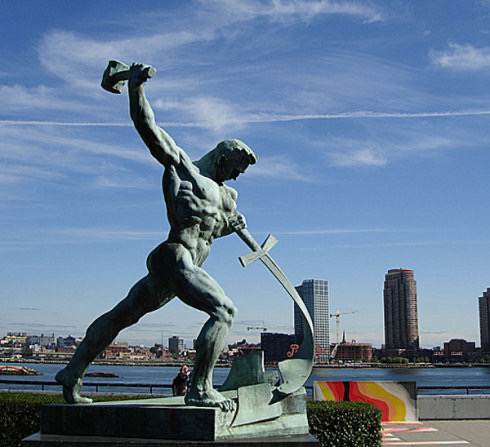
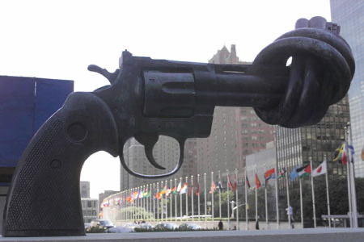

> 通过视觉，来传达反对战争和珍惜和平的感情。
>
> 
>
> 
>
> 

一个肌肉健硕的男子，像是浴血奋战的角斗士，右脚在前迈着弓步，脚趾牢牢抓地，左脚蹬地，随时准备发力，右手高高的抡起重重的铁锤，左手紧紧的把剑按在胸前，眼睛死死的盯着断剑。一锤呼之欲出，这一锤是对战争的厌恶，这一锤是对和平的渴望，这一锤是对新生的向往。远处高楼平地起，是对这一锤的呼应。

一把枪管被拧成了麻花样的，枪身黝黑的左轮手枪，以一种不可思议的方式保持着平衡。细细看，像一个人握着枪，另一个人握着枪管，把它打成结后，然后说“是时候结束战争了”。
