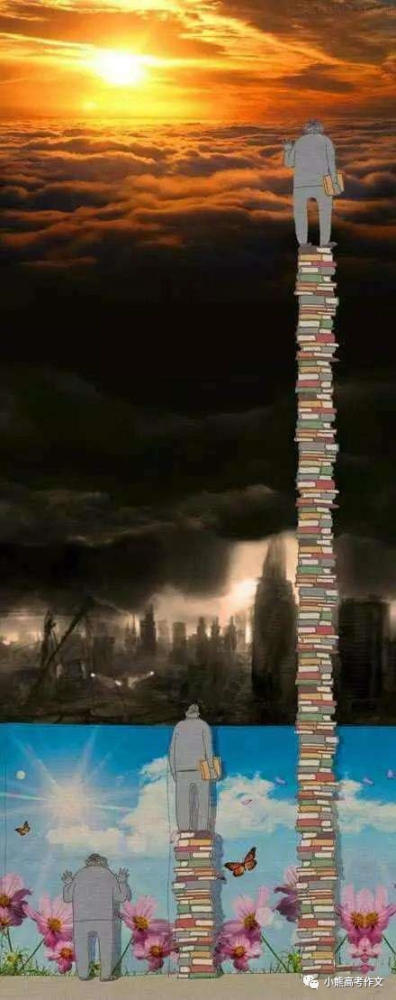

> 通过视觉、反驳读书无用论、呼吁大家读书、读好书，号召大家内心充满阳光和温暖。
>
> 

一个富人在沙滩散步，见到一个穷汉衣衫褴褛地躺在礁石上晒太阳。
于是富人就对穷汉说：你为什么不去挣钱呢?
穷汉说：挣钱干什么?
富人说：挣钱开工厂。
穷汉问：开工厂干什么?
答：可以挣更多的钱呀!
再问：挣更多的钱干什么?
又答：开更多的工厂呀!
再问：下面呢?
又答：有了许多的钱就可以全世界去观光，可以买海边最好的别墅!
穷汉还接着问：看世界，买别墅后又怎样?
富人答道：你就可以无忧无虑地海边晒太阳了啊!
穷人说了一句：对不起，我现在已经在晒太阳了，你走吧。
