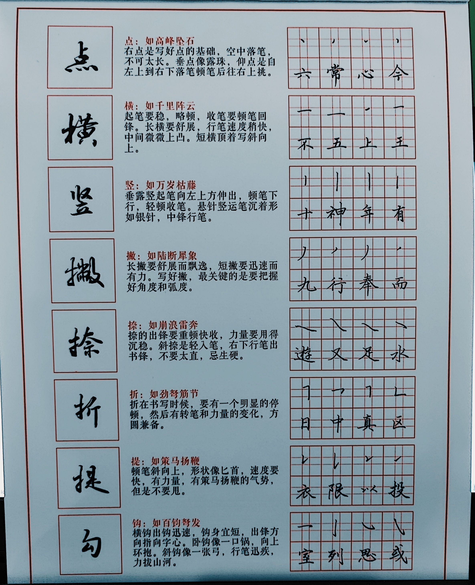

### 点：如高峰坠石

右点是写好点的基础，空中落笔，不可太长。垂点像露珠，仰点是自左上到右下落笔顿笔后往左路上挑。

### 横：如千里阵云

起笔要稳，略顿，收笔要顿笔回锋。长横要舒展，行笔速度稍快，中间微微上凸。短横顶着斜向上。

### 竖：如万岁枯藤

垂露竖起笔向左上方伸出，顿笔下行，轻顿收笔。悬针竖运笔沉着形如银针，中锋行笔。

### 撇：如陆断犀象

长撇要舒展而飘逸，短撇要迅速而有力。写好撇，是关键的是要撑握好角度和弧度。

### 捺：如崩浪雷奔

捺的出锋要重顿快收，力量要用得沉稳。斜捺是轻入笔，右下行笔出书锋，不要太直，忌生硬。

### 折：如劲弩筋节

折在书写时候，要有一个明显的停顿，然后转笔和力量的变化，方圆兼备。

### 提：如策马扬鞭

顿笔斜向上，形状像匕首，速度要快，有力量，有策马扬鞭的气势，但不要甩。

### 勾：如百钧弩发

横勾出钩迅速，钩身宜短，出锋方向指向字心。卧钩像一口锅，向上环抱。斜钩像一张弓，行笔迅疾，力拔山河。

