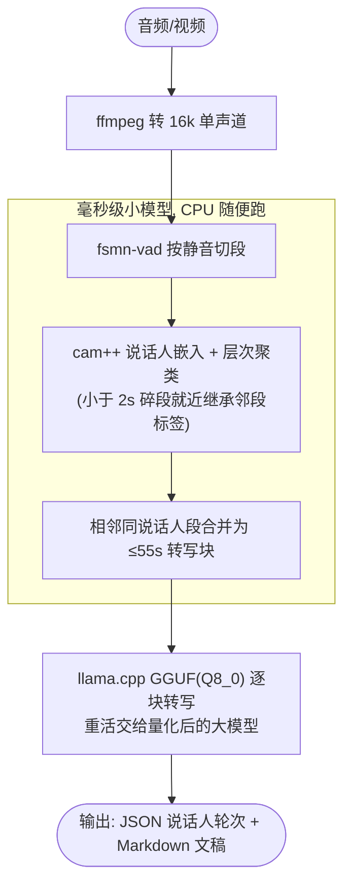

> 七个多月前，我写过一篇《部署和使用 FunASR》，记录从 whisper 换到 FunASR 的过程。七个多月后，我把这套服务换成了 Confucius4-R2T2。这篇文章完整记录决策链：为什么换、架构怎么定、量化怎么选、靠什么数据下结论，以及付出了什么代价。  

## 一、为什么选 Confucius4-R2T2

我有个 Java 小项目：采集音视频，本地转写，入库供检索。环境使用 MacBook Pro M1 Pro (32GB) + OrbStack，无 GPU。  

这套转写栈已经做了两次迭代。一开始使用 whisper：识别不准、没有标点、时不时蹦出繁体，最难受的是会在结尾冒出些奇怪的内容 —— 长期靠 LLM 修正表兜底。后来 FunASR(aliyun funasr runtime: Paraformer-large + VAD + 标点 + ngram 语言模型 + 数字规整)就是为了治这些毛病换的：检测、识别、标点、数字规整一站式，服务端自带 ffmpeg，还支持热词；WebSocket 协议，单容器，RTF≈0.05(Real-Time Factor，实时率 = 转写耗时 ÷ 音频时长，小于 1 即比实时快，越小越快) —— 3.7 分钟的音频 11 秒转完。一用就是七个多月，看起来够用了。

最近看到 Confucius4-R2T2 霸榜的消息，网易有道子曰-Live 系列的 **Confucius4-R2T2**：与 Qwen3-ASR 同架构的 2B 微调版。同期开源的还有流式翻译模型 Confucius4-T3PO，两个模型发布时在 HuggingFace 双双登顶各自细分 Trending 榜 —— R2T2 是 ASR 榜第一。

让我觉得可以再次迭代的原因，我的 Mac 能跑得起来。官方放出了 GGUF 量化仓库([netease-youdao/Confucius4-R2T2-GGUF](https://huggingface.co/netease-youdao/Confucius4-R2T2-GGUF) )，海外开发者还主动做了 C++ 移植(audio.cpp)；llama.cpp 官方二进制直接能跑，Ollama 一条命令就能拉起。别人愿意真花时间做适配，说明这东西能用。 

之前有人问我 FunASR 对比 Qwen3-ASR 怎么样 —— 严格说 FunASR 是一套框架/平台，包含一整套流水线，其中负责转写的默认模型是 Fun-Asr，是可以更换的（比如换成 Paraformer、SenseVoice，Qwen3-ASR 也可以），具体参考 [HuggingFace 上的这篇讨论]( https://huggingface.co/Qwen/Qwen3-ASR-1.7B/discussions/24 )。这次同题对比也算顺带验证了那个问题，毕竟 Confucius4-R2T2 就是基于 Qwen3-ASR 架构。

## 二、技术验证

让 AI 作了技术验证，得出五条结论：  

1. **用 FunASR 直接跑 Confucius4-R2T2 大模型，CPU 上 RTF≈90**，完全不可用(3.7 分钟音频要转 4~6 小时)；但它的两个小模型是**毫秒级**的 —— VAD(fsmn-vad)RTF 0.003，说话人嵌入(cam++)RTF 0.006。 
2. **llama.cpp 只有 HTTP(含 SSE)，没有 WebSocket。**旧栈的 WS 客户端要自己初始化配置、按块发送音频、发结束标志、解析回包，其实也不简单；新栈换成一次 HTTP multipart 上传就完事，倒也省事。  
3. **mp3 可以直传 llama.cpp、mp4/AAC 不行**，报 "Failed to tokenize prompt"。视频必须先经 ffmpeg 抽音轨。  
4. **单请求受上下文限制**：音频约占 13 token/s，`-c 4096` 下约 5.2 分钟封顶。长音频必须分段。  
5. 输出带 `language Chinese<asr_text>` 前缀，需要剥离。

FunASR 不能直接使用，Mac 跑不动，特别是在容器里跑，应该以 llama.cpp 为主，但是因为 FunASR 的 VAD 和说话人嵌入等还是不错的，也应该吸收过来。  

## 三、FunASR 降级为预处理层

最终架构各取所长：  



FunASR 从“转写引擎”降级成“预处理层”，只负责 VAD 切段和说话人分离；文本生成的重活全部交给 GGUF，比 FunASR 调用 Confucius4-R2T2 原生 CPU 转写快两个数量级。  

说话人分离的输出长这样：  

```markdown
**【说话人 1】**(00:00-00:06)之前有顾客自己带酒水,也没加收钱或者不让喝。  
```

实测：224.5 秒独白音频，`speakers=1` 无误检；42.3 秒双人交替对话，`speakers=2` 且四轮完美交替。预处理开销可以忽略 —— 耗时全在转写本身。  

## 四、量化怎么选：Q8_0 是甜点位

GGUF 部署要选量化档。7 个测试文件(约 7.5 分钟)做全量化 A/B：  

| 量化       | 容器 CPU RTF    | 镜像体积       | 质量                |
| -------- | ------------- | ---------- | ----------------- |
| f16      | 0.52-0.57     | 6.87GB     | 基准                |
| **Q8_0** | **0.42-0.45** | **5.26GB** | **与 f16 字词级几乎全同** |
| Q4_K_M   | 0.42          | 4.24GB     | 歧义短语上与 f16 各有输赢   |

一个有意思的发现：f16 在容器 CPU 和 Mac Metal 上输出**逐字节一致** —— 意味着结果可复现，所有 A/B 对比因此可信。  

结论：Q8_0 质量≈f16、速度≈Q4_K_M，标准的甜点位，设为默认模型。差异仅在个别标点与语气词(Q8 的标点反而更规范)；至于“推倒重来/推导出来”这类音频本身就歧义的短语，任何引擎、任何量化都会翻转，不计分。  

## 五、同题 A/B：可以换成 R2T2

用 5 个真实 mp3(共 3.7 分钟)同题对比：  

| 维度     | FunASR(aliyun runtime)     | R2T2(Q8_0)                |
| ------ | -------------------------- | ------------------------- |
| 幻觉     | 1 处：结尾凭空多出"没有有没有。"         | 无，5/5 干净收尾                |
| 断句     | "推导出来了。若干次"(错位)            | "推倒重来了若干次"(断句正确)          |
| 伪影     | ITN 空格伪影("14 个")           | 无                         |
| 语气词    | 丢("呃")                     | 完整保留                      |
| 标点     | 粗糙生硬                       | 细腻自然                      |
| 专有名词   | "李笑来"✓ "定投"✓               | 同样 ✓                      |
| **速度** | **单文件 1.7-3.1s(RTF≈0.05)** | 单文件 12-25s(RTF 0.42-0.45) |

质量上新栈全面占优，且没有一处实质字词错误输给对方；速度上 FunASR 快约 10 倍 —— 但我的场景是**批量离线转写**，RTF 0.05 和 0.42 都远快于实时，都是后台任务，没有本质区别。质量优先，决定切换成 R2T2。  

## 六、最终形态：一个容器一个端口

最后一步，把所有能力收进一个自包含镜像 `r2t2-gguf:latest`(5.26GB，模型全部内置)：  

```bash
docker run -d --name r2t2-asr -p 8080:8080 r2t2-gguf:latest
```

起来就是一个 ASR 网关，四组端点：  

- `POST /v1/audio/transcriptions` —— OpenAI 兼容，短音频字节级透传，老客户端零改动;  
- `POST /asr/jobs` —— 提交长音视频任务(mp4/ts/m4a 等任意 ffmpeg 支持的格式)，返回 202 + job_id;  
- `GET /asr/jobs/{id}` —— 轮询进度，逐块更新 n/N;  
- `DELETE /asr/jobs/{id}` —— 取消，块间生效，保留已完成部分。

内部逻辑：≤270s 的音频单发直译；超了就自动走完整管线 —— ffmpeg 抽轨、VAD、说话人分离、分块转写。网关本体 `asr_server.py` 约 300 行，纯 Python 标准库，没有给镜像增加任何依赖。Java 侧只对接两个方法：短音频同步透传；长视频提交任务 + 10 秒轮询 + 进度停滞看门狗，结果按“源文件.txt”旁路缓存，幂等可重试。  

**为什么长音频必须分块，不能放大上下文硬扛？**实测过:`-c 32768` 单发 10.4 分钟尚可用(RTF 0.72)；但 31.2 分钟时生成速度从 6.6 token/s 一路衰减到 3.0 以下，**比实时还慢**(RTF>2)。而分块方案的 RTF 恒定在 0.43-0.50，与时长无关 —— 31.2 分钟音频分块转写 835.8s(RTF 0.447)。  

**实战验证**：63.1 分钟的真实 mp4(AV1+AAC，英文演讲)直接扔给网关 —— 容器内自动抽轨，74 块、识别出 3 个说话人、45,367 字符、端到端 1751.6s，**RTF 0.462**，与预估一致；首尾干净，无幻觉；中途 DELETE 也能干净取消。以我现在 Mac 上的容器跑法，29 分钟能转完一小时视频。  

顺带记录一个值得警惕的 bug：早期 Dockerfile 里多源 `COPY fsmn-vad campplus /models/funasr/` 会把两个目录的**内容摊平**进同一层，子目录从未真正存在；而 FunASR 收到不存在的本地路径时会**静默回退到在线下载** —— 所谓"运行时免下载"其实从未成立，小模型一直是运行时在线拉的，只是恰好没人断网发现过。修复后加了显式路径检查才算闭环。 

## 七、代价清单

切换后的问题：

- **速度慢了约 10 倍**：RTF 0.42 对 0.05，一小时视频转 29 分钟。离线批量无感，但要实时出稿的场景，这套 CPU 方案不适合；
- **热词降级**：旧栈原生热词，新栈只能经 prompt 字段透传，效果依赖 llama.cpp 版本对该模型上下文偏置的支持；
- **没有流式**：需要的话得上 R2T2 官方 NVIDIA CUDA 栈；
- **真要快还有后手**：Mac 上原生 llama.cpp + Metal 能到 RTF≈0.06(容器里没有 GPU 加速)；Linux 服务器换 CUDA 版 llama.cpp 即可，镜像构建留了变体参数。

换来的是：转写质量提升；说话人分离、视频直转能力上线；为 whisper 幻觉长期兜底的 LLM 修正表等防御性逻辑，这次可以正式退休了。  

## 八、写在最后

回顾这次的迭代升级，有三点心得值得留下来：

1. 选型时与其盯着 benchmark，不如看有没有人真金白银地为它做移植、做量化、做集成。这样可以在不同的环境中验证是否适合自己。 
2. FunASR 调用R2T2大模型在 CPU 上不可用，但它的毫秒级小模型正好补位。“新模型干重活、旧栈降级当预处理”的混合流水线，可以推广到很多"大模型本地跑不动"的场景。  
3. 多作 A/B 测试，要同题、要真实数据、要可复现，f16 跨设备逐字节一致，让所有对比有了基准；5 个真实 mp3 的胜负表，升级迭代决定一目了然。
